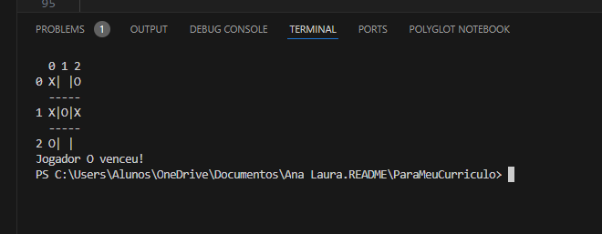

## Como foi utilizado
O projeto do jogo da velha em C# foi desenvolvido como um aplicativo de console, permitindo que dois jogadores se enfrentem.
O usuário interage digitando as coordenadas onde deseja colocar seu símbolo (X ou O), e o jogo prossegue até que um jogador vença ou ocorra um empate.

## A implementação seguiu algumas etapas principais: 
primeiro, definiu-se os requisitos e a lógica do jogo, seguido da configuração do ambiente e da criação da estrutura de dados para o tabuleiro.
Em seguida, foram desenvolvidos métodos para alternar jogadores, validar jogadas e verificar vencedores ou empates.
A interface do usuário foi criada para exibir o tabuleiro e coletar as entradas dos jogadores, e o código foi comentado para facilitar a compreensão.

## O backlog 
do projeto inclui possíveis melhorias, como a criação de uma interface gráfica, 
um modo de jogo contra o computador, um sistema de pontuação e validação de entrada mais robusta.

## Em conclusão 
o projeto proporcionou uma oportunidade valiosa para praticar conceitos de programação e destacou a importância de uma boa organização e documentação no desenvolvimento de software.
Através das etapas de implementação, foi possível criar um jogo funcional, com espaço para expansão e aprimoramento futuro.

